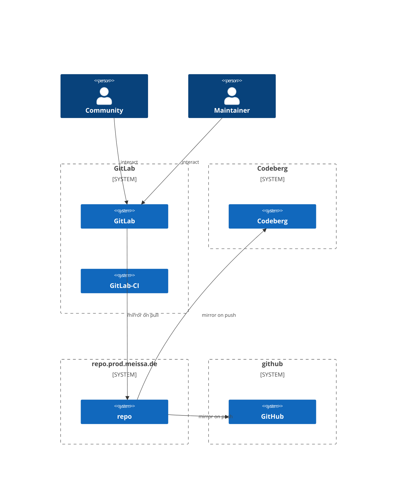
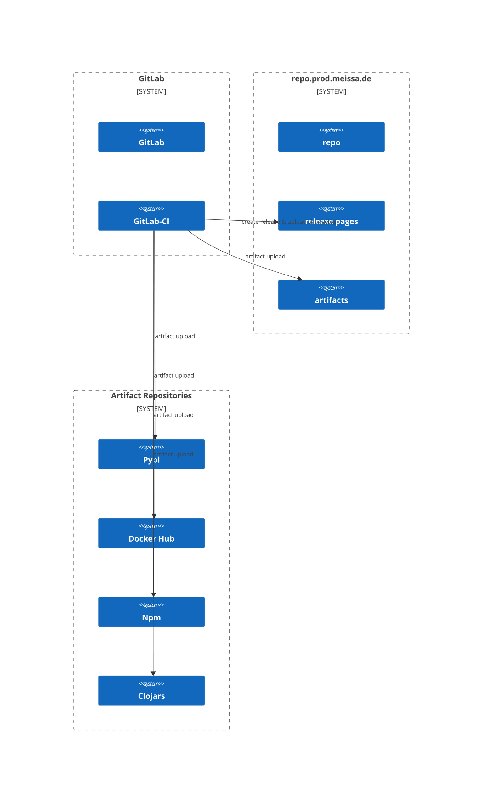

# federate-your-repos

Support mirroring your federated repositories to common plattforms in order to get found.

## Rational

It is always the same - it's about regaining digital sovereignty.

With OpenSource, the story is absolutely comparable to the situation on Twitter, Facebook or Youtube. You have invested countless hours to realize your idea and building a community. The big platforms profit from this.

We advocate that the fruits of our investment end up with us and not with Microsoft, Facbook, Twitter or Gitlab.

So we will not longer propagate Links to Github, Gitlab or any other foreign platform. In al fully federated world that will be the idea.

But in the time beeing we will not livbe in this perfect world. So we present our model to handle this intermediate time. There are some principles:

1. Any marketing invest (links in blogs, mblogs, toots, ...) will link to our own repository.
2. In order to enable interaction with our community we accept issues & PR on the most relevant and the least unappealing platform.
3. We interact primarily with the platform our CI is running on.
4. We mirror our repository to the remaining bunch of platforms in order to get found if someone is searching for our OpenSource solution.
5. Every repository has an section where we accept Issues & PRs and where mirrors exist.

## Realisation

# Mirroring

At the moment our CI is running on gitlab, so thats our current model

## Artefacts & CI

