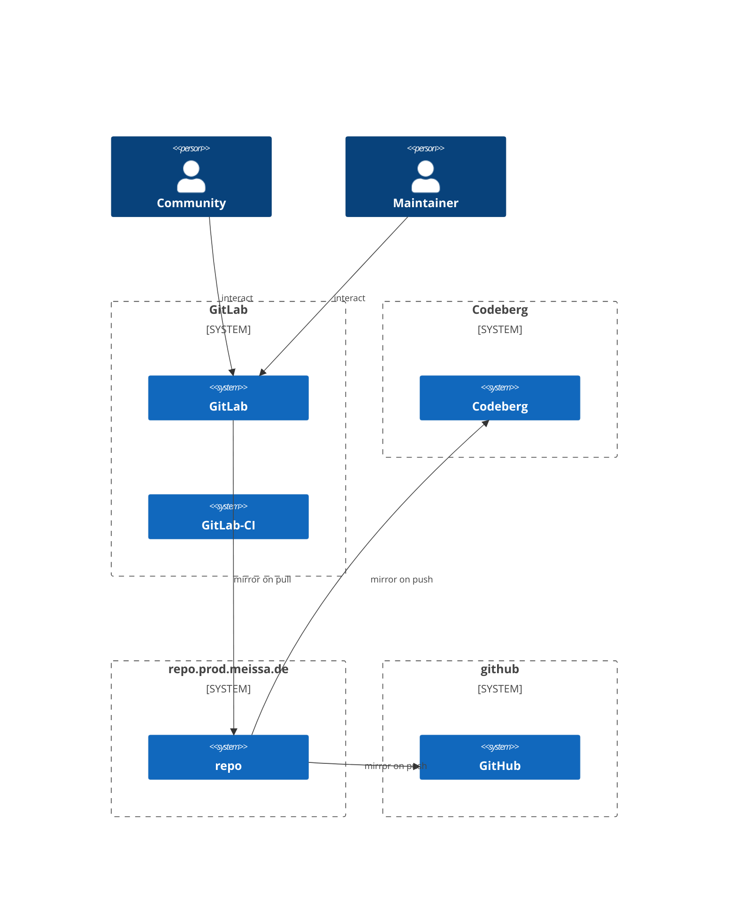
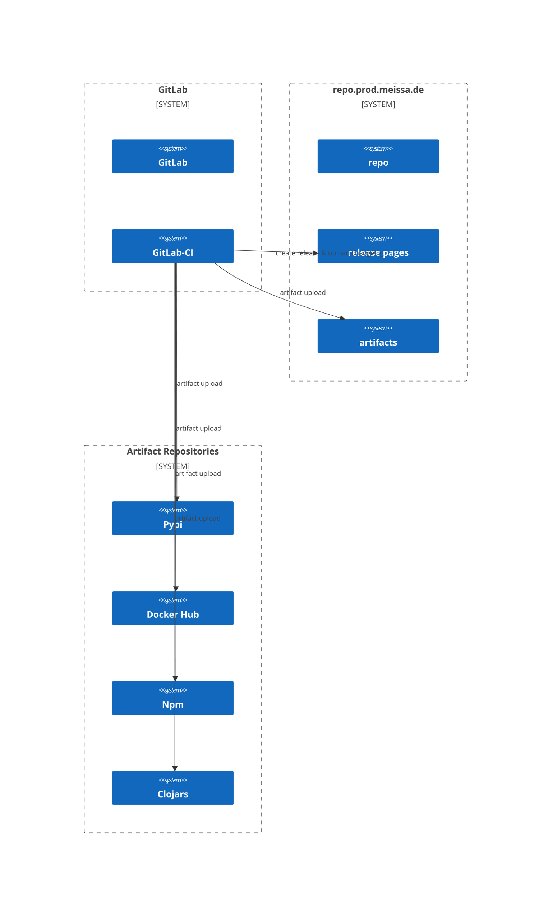

# Mirroring

At the moment our CI is running on gitlab, so thats our current model

```mermaid
C4Context
    Person(community, "Community")
    Person(maint, "Maintainer")

    System_Boundary(gitlab, "GitLab") {
        System(gitlab-repo, "GitLab")
        System(gitlab-ci, "GitLab-CI")
    }
    System_Boundary(codeberg, "Codeberg") {
        System(cb-repo, "Codeberg")
    }
    System_Boundary(gitea, "repo.prod.meissa.de") {
        System(gitea-repo, "repo")
    }
    System_Boundary(github, "github") {
        System(github-repo, "GitHub")
    }

    Rel(maint, gitlab-repo, "interact")
    Rel(community, gitlab-repo, "interact")

    Rel(gitlab-repo, gitea-repo, "mirror on pull")
    Rel(gitea-repo, github-repo, "mirror on push")
    Rel(gitea-repo, cb-repo, "mirror on push")

    UpdateLayoutConfig($c4ShapeInRow="3", $c4BoundaryInRow="2")
```

## Artefacts & CI

```mermaid
C4Context
    System_Boundary(gitlab, "GitLab") {
        System(gitlab-repo, "GitLab")
        System(gitlab-ci, "GitLab-CI")
    }
    System_Boundary(gitea, "repo.prod.meissa.de") {
        System(gitea-repo, "repo")
        System(gitea-release-pages, "release pages")
        System(gitea-artifacts, "artifacts")
    }
    System_Boundary(art, "Artifact Repositories") {
        System(pypi, "Pypi")
        System(docker, "Docker Hub")
        System(npm, "Npm")
        System(clojars, "Clojars")
    }   

    Rel(gitlab-ci, gitea-release-pages, "create release & upload changelog")
    Rel(gitlab-ci, gitea-artifacts, "artifact upload")
    Rel(gitlab-ci, clojars, "artifact upload")
    Rel(gitlab-ci, pypi, "artifact upload")
    Rel(gitlab-ci, npm, "artifact upload")
    Rel(gitlab-ci, docker, "artifact upload")

    UpdateLayoutConfig($c4ShapeInRow="3", $c4BoundaryInRow="2")
```